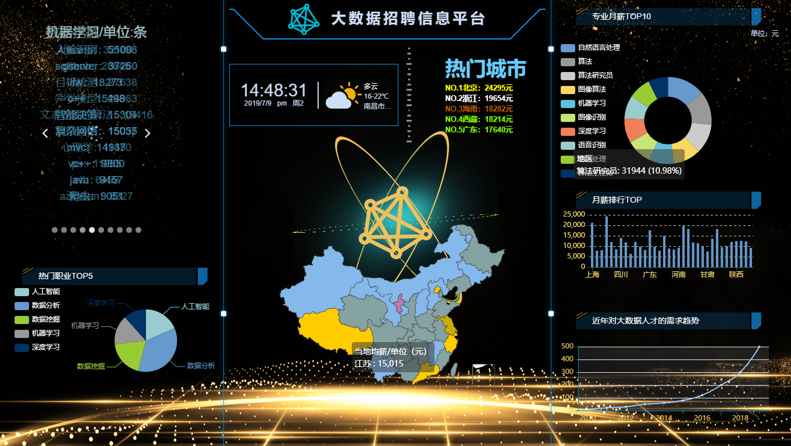

# 1、基于大数据的招聘信息分析平台 

本项目使用 hadoop 集群（一主两从）作为数据清洗的环境，其中 hadoop 集群包括 hadoop、zookeeper、hive、hbase 等软件组成。Tomcat 作为前端页面展示环境。数据清洗中，使用 java 编写的 MapReduce 进行特殊清洗，使用hive 的 HQL 语句进行细化清洗，使用 java 编写的 UDF 进行特殊细化清洗。前端页面展示中，使用 java 编写的 servlet 与 hbase 交互，获取数据并用 js 解析，把结果通过使用 echarts 表格、layui 等界面等框架配合优化展示效果，最终展示形式采用网页形式。

# 2、 文件说明

* Java 后端代码 实现servlet与hbase交互
* shell 自动化shell脚本
* web web项目 （eclipse）
* project File.pdf 项目环境搭建文档
* imgs 项目相关图片

# 3、 项目环境

	hadoop完全分布式环境：一主两从

# 4、 软件版本选型

*  jdk-8u201-linux-x64
*  apache-tomcat-7.0.94
*  hadoop-2.6.0-cdh5.14.2
*  MySQL-5.5.40-1.linux2.6.x86_64
*  hive-1.1.0-cdh5.14.2
*  zookeeper-3.4.5-cdh5.14.2
*  hbase-1.2.0-cdh5.14.2

# 5、 项目可视化展示

